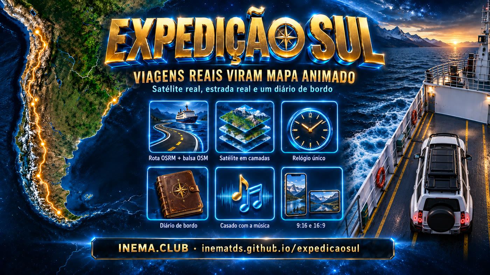

# Expedição Sul — animações de trajeto

[](https://inematds.github.io/expedicaosul/guia/)

Três viagens de carro pelos Andes, pelo pampa e pelo litoral do Uruguai, transformadas em **animações de mapa**:
satélite real, o veículo andando na estrada verdadeira, painel com km, altitude, país e estrada, e embaixo um
**diário de bordo** com foto real e um fato verificado de cada lugar por onde se passa. Cada viagem sai em
**9:16** (Reels/Shorts/WhatsApp) e **16:9** (YouTube/TV), 60 fps no master.

Feito com [HyperFrames](https://hyperframes.heygen.com) (HTML → vídeo) e Claude Code, em 24/09/2026.

## 📖 Guia de uso

Guia completo (os 6 vídeos + como o motor de rota funciona + passo a passo): **https://inematds.github.io/expedicaosul/guia/**

---

## Os vídeos

| Viagem | Veículo | Distância | Duração | 9:16 | 16:9 |
|---|---|---|---|---|---|
| **Hua Hum** — San Martín de los Andes (AR) ▸ Pirihueico (CL) | Hyundai Tucson + Land Rover Defender 110 | 54,3 km | 74,4 s | [assistir](videos/trajeto-hua-hum-9x16.mp4) | [assistir](videos/trajeto-hua-hum-16x9.mp4) |
| **A volta** — San Martín de los Andes ▸ Canela (RS) | Defender 110 | 2.797 km | 113,6 s | [assistir](videos/volta-defender-9x16.mp4) | [assistir](videos/volta-defender-16x9.mp4) |
| **A ida** — Canela ▸ San Martín de los Andes | Defender 110 | 2.882 km | 95,7 s | [assistir](videos/ida-defender-9x16.mp4) | [assistir](videos/ida-defender-16x9.mp4) |

<table>
<tr>
<td align="center"><b>Hua Hum</b><br><video src="videos/trajeto-hua-hum-9x16.mp4" poster="videos/trajeto-hua-hum-9x16.jpg" width="240" controls preload="none"></video></td>
<td align="center"><b>A volta</b><br><video src="videos/volta-defender-9x16.mp4" poster="videos/volta-defender-9x16.jpg" width="240" controls preload="none"></video></td>
<td align="center"><b>A ida</b><br><video src="videos/ida-defender-9x16.mp4" poster="videos/ida-defender-9x16.jpg" width="240" controls preload="none"></video></td>
</tr>
</table>

> Os arquivos deste repositório são a versão web (30 fps, ~43 MB). Os masters 60 fps (300+ MB) ficam fora do git.

### Hua Hum (54,3 km, 1 fronteira)
San Martín de los Andes → Lago Lácar → ponto mais alto do dia (1.038 m, km 16,5, na RP48 de ripio) → Playa de Yuco →
Lago Nonthué → Puerto Hua Hum → **Paso Hua Hum** (fronteira AR ▸ CL, km 43,7) → Ruta CH-203 → Puerto Pirehueico.

### A volta (2.797 km, 3 países)
San Martín de los Andes → descida dos Andes pela RN 237/RN 22 → Río Colorado ("adeus, Patagônia") → Bahía Blanca →
Azul → Moreno → Buenos Aires → **balsa Colonia Express pelo Río de la Plata (51 km, 1h15)** → Colonia del Sacramento →
Paso de los Toros → **Fronteira da Paz** (Rivera/Sant'Ana do Livramento) → BR-158/BR-290 → Porto Alegre → Canela.

### A ida (2.882 km, 3 países)
Canela → BR-471 pelo Taim → **Chuí/Chuy** (BR ▸ UY) → La Paloma → Pueblo Garzón (a antiga estação de trem) →
Punta del Este → San Carlos → Colonia → **balsa até Buenos Aires** → Moreno → RN 5 → Santa Rosa → Río Colorado em
25 de Mayo ("olá, Patagônia") → San Martín de los Andes.

---

## Como foi feito

Um único **motor de animação de rota** (HTML + GSAP, renderizado pelo HyperFrames) lê três arquivos de dados e desenha
tudo a partir de **um relógio só** — posição do carro, câmera, linha percorrida, pinos, HUD, trilho de altitude e cards
saem da mesma função do tempo, então nada fica fora de sincronia.

| Camada | Fonte |
|---|---|
| Rota (estrada) | OSRM, por pernas entre as paradas do link do Google Maps |
| Balsa | linha OSM da **Colonia Express** (Buenos Aires ↔ Colonia), com a duração marcada no OSM |
| Satélite | Esri World Imagery — visão geral (z7), corredor (z8) e recortes em alta (z10/z12) em cada parada; cada recorte só aparece quando cobre o quadro inteiro |
| Lagos (Hua Hum) | repintados com os polígonos de água do OSM (tira manchas de reflexo do mosaico) |
| Fronteiras | OSM (admin_level=2) nas cidades de fronteira; Natural Earth na escala continental |
| Altitude | SRTM 30 m via OpenTopoData (trilho de altitude, HUD e cards de dados) |
| Fatos dos cards | Wikipedia (ES/PT/EN), cada frase com fonte salva em `*/data/facts/` |
| Fotos | Wikimedia Commons, conferidas por categoria/local, com autor e licença |
| Veículos e balsa vistos de cima | gerados no flux2-klein local e recortados (chroma key) |
| Trilhas | geradas (Lyria 3 Pro) e **analisadas** (BPM, entrada do groove, silêncio): o carro larga quando a batida entra, a balsa atravessa no trecho calmo e o carimbo de fronteira cai no retorno da música |

### Estrutura

```
trajeto-hua-hum/        vídeo Hua Hum (motor v1, dois carros) + data/ (scripts e dados)
trajeto-hua-hum-16x9/   variante 16:9
volta-defender/         motor genérico de rota longa + assets/trip.js da volta
volta-defender-16x9/    variante 16:9 (assets por link simbólico)
ida-defender/           mesmo motor + assets/trip.js da ida
ida-defender-16x9/
make_16x9.py            gera a variante 16:9 trocando só os blocos de layout
render_share.sh         render 60 fps + versão de compartilhar (-14 LUFS)
tg_encode.sh            versão ≤ 44 MB (Telegram / web)
videos/                 os 6 vídeos (versão web) + capas
FALHAS.md               changelog de falhas corrigidas
```

### Nova viagem com o motor

1. `data/`: rotas OSRM por pernas + `build_route2.py trip.json` (rota única, balsa, fronteira, altitude, paradas).
2. `build_tiles.py route_full.json ../assets` (satélite), `photos_search.py` / `photos_get.py` (fotos + créditos), `fetch_facts.py` (fatos).
3. Escrever `assets/trip.js`: agenda de chegada/saída por parada (casada com a música — `beat.py` mede BPM e fase), cards, carimbos, rótulos.
4. `npx hyperframes check` → `python3 make_16x9.py <proj> <proj>-16x9` → `render_share.sh`.

---

## Estatísticas de produção

Medido nos logs da sessão do Claude Code (tokens por chamada), não estimado. Custo em **dólar equivalente de API** pela tabela
oficial (Opus 5.5: US$ 4 entrada / 20 saída / 0,20 leitura de cache / 8 escrita de cache 1 h, por milhão de tokens;
Haiku 4.5: 1 / 5 / 0,10 / 2). Quem usa o Claude Code por assinatura não paga esse valor por uso — serve para comparar.

### Custo e tempo por vídeo

| Vídeo | Tempo ativo do agente | Chamadas | Custo IA (US$) | Créditos Magnific | Render local |
|---|---|---|---|---|---|
| Hua Hum 9:16 | 55 min | 89 | **13,12** | 190 | 3 × ~1m50 |
| Hua Hum 16:9 | ~5 min | 8 | **1,07** | — | 1m44 |
| A volta (9:16 + 16:9) | 38,5 min | 53 + 5 subagentes | **15,18** | 180 | 4 × ~2m40 |
| A ida (9:16 + 16:9) | 24,4 min | 37 + 4 subagentes | **6,85** | 160 | 2 × ~2m15 |
| **Total** | **~2h03** | **187 + 9** | **36,22** | **530** | ~24 min |

Composição do custo: agente principal (Opus 5.5) US$ 30,97 · revisor (3 consultas, Opus 5.5) US$ 4,32 ·
subagentes (Haiku 4.5, tarefas mecânicas: baixar satélite e fotos, gerar sprite, renderizar) US$ 0,93.
Custo zero: geração de imagem local (flux2-klein, ~2 min de GPU) e todos os renders (HyperFrames local).
Créditos Magnific: 3 trilhas × 160 + efeitos (whoosh, carimbo, buzina de navio).

### Volume de cache (tokens)

| Vídeo | Lidos do cache | Gravados no cache (1 h) | Entrada sem cache | Saída | Acerto de cache |
|---|---|---|---|---|---|
| Hua Hum 9:16 | 24,64 M | 383 mil | 538 mil (revisor) | 136 mil + 14 mil (revisor) | 98,5% |
| Hua Hum 16:9 | 3,33 M | 20 mil | — | 12 mil | 99,4% |
| A volta | 29,59 M + 1,27 M (subag.) | 588 mil + 319 mil (subag.) | 439 mil (revisor) | 105 mil + 15 mil | 98,0% |
| A ida | 23,20 M + 0,63 M (subag.) | 112 mil + 224 mil (subag.) | — | 48 mil + 4 mil | 99,5% |

Leitura dos números:
- **98–99,5% da entrada veio do cache** — é o que mantém o custo baixo apesar de ~85 M tokens lidos.
- **O revisor é caro por chamada**: manda a conversa inteira sem cache (~300–540 mil tokens por consulta).
- **O 16:9 quase não custa** (US$ 1,07 no Hua Hum; na volta e na ida é só troca de layout + render).
- **A ida custou menos da metade da volta**: a volta pagou a construção do motor genérico, a ida só reaproveitou.
- Uma pausa longa derruba o cache (validade de 1 h): uma pergunta feita 8 h depois regravou ~760 mil tokens (US$ 7,41).

---

## Créditos

**Mapa e dados:** Esri World Imagery (Esri, Maxar, Earthstar Geographics) · © colaboradores do OpenStreetMap (ODbL) ·
Natural Earth · OSRM · SRTM 30 m via OpenTopoData · Wikipedia (ES/PT/EN).

**Fotos (Wikimedia Commons):**
- Hua Hum — Albasmalko (dom. público) · Marco Antonio Correa Flores (CC BY-SA 4.0) · Falk2 (CC BY-SA 4.0) · Gervacio Rosales (CC BY 3.0) · Manueldutruel (CC BY-SA 4.0).
- A volta — Albasmalko · Alvaro Errandonea (CC BY 3.0) · Juan Corral / Municipalidad de Bahía Blanca (CC BY 2.5 AR) · Elquache (CC BY-SA 3.0) · Walteriot (CC BY-SA 3.0) · NASA JSC Earth Sciences (dom. público) · Roxyuru (CC BY-SA 3.0) · Diego Delso (CC BY-SA 3.0) · bullit (CC BY 3.0) · Zeroth (CC BY-SA 4.0) · Mx. Granger (CC0) · Fernando da Rosa (CC BY-SA 3.0) · Ricardo André Frantz (CC BY-SA 3.0) · Cristine Denardi Huff (CC BY-SA 4.0) · Rosanetur (CC BY 2.0) · Fernando Schultz Aldado (dom. público).
- A ida — Rosanetur · Fernando Schultz Aldado · Giácomo Luiz Mancini (CC BY-SA 4.0) · John Seb Barber (CC BY 2.0) · Granjuanlll (CC BY-SA 3.0) · Jimmy Baikovicius (CC BY-SA 2.0) · Eduardo.terian (CC BY-SA 3.0) · María Cecilia (CC0) · mriaco (CC BY 3.0) · NaBUru38 (CC BY-SA 4.0) · Diego Delso · bullit · Roxyuru · NASA JSC · Walteriot · Juanedc (CC BY 2.0) · Jmmuguerza (CC BY-SA 4.0) · Silvio omar (CC BY-SA 4.0) · Albasmalko · Marco Antonio Correa Flores.

**Gerado por IA:** veículos e balsa vistos de cima (flux2-klein) · trilhas e efeitos sonoros (Magnific — Lyria 3 Pro / ElevenLabs).

Conteúdo aberto do [INEMA.CLUB](https://inema.club).
